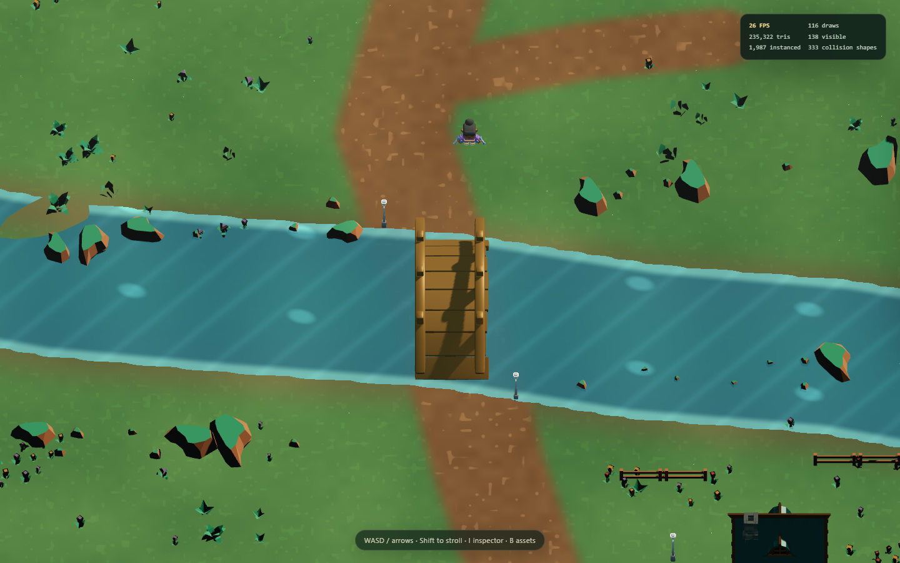
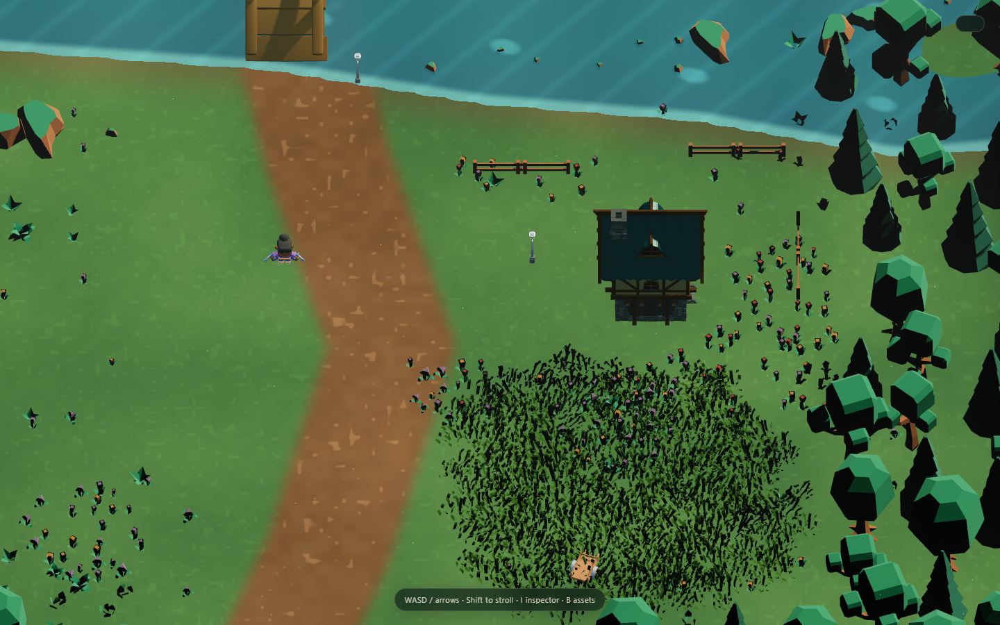
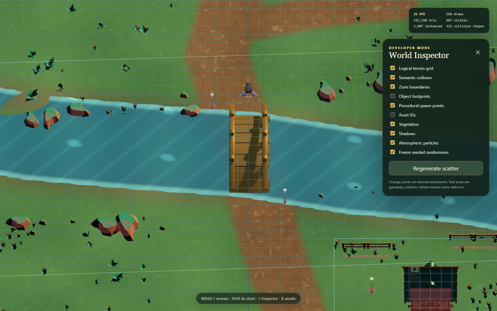

# Agentic World Synthesis

Agentic World Synthesis now contains two complementary, working vertical slices:

- a deterministic Python compiler and Godot 4 client proving YAML → validation → normalized maps → playable semantics;
- a new Three.js hybrid renderer proving that a compact semantic WorldSpec plus real reusable assets and seeded composition can produce a materially richer 2.5D environment.

The new showcase is **The Willowwater Way**, one explorable forest route/town edge with a winding path, meadow, animated river, authored bridge and ranger lodge, trees, reactive tall grass, shrubs, rocks, fences, flowers, signs, lanterns, market props, terrain variation, particles, an animated player, semantic collision, and a smooth JRPG camera. It is intentionally one polished experiment—not another open-world expansion.

## Hybrid visual proof





The renderer and gameplay semantics remain inspectable:



Visible environmental objects are registered GLB assets rather than agent-drawn SVG or primitive mesh substitutes. The logical world stays simple: paths and water are polylines, zones are polygons, collision is explicit, and repeated detail comes from deterministic scatter profiles. Terrain foundations, the water surface, effects, particles, invisible collision, and debug overlays may use utility geometry.

The art is cohesive, legal CC0 prototype art from Kenney and Quaternius. It is substantially stronger than the earlier code-drawn presentation, but it is still provisional: the terrain shader is stylized rather than painterly, some Nature Kit foliage has harsh low-poly contrast, and there is no GPU culling/LOD streaming yet.

## Run the hybrid showcase

Prerequisites: Node.js 24+ and a WebGL2-capable browser. This session used Node 24.19.0, npm 11.17.0, Three.js 0.185.1, and Chrome headless via SwiftShader.

```powershell
cd hybrid
npm.cmd install
npm.cmd run dev
```

Open <http://127.0.0.1:4173>. Controls:

- WASD or arrows: move
- Shift: stroll
- I: world inspector
- B: asset browser

The inspector toggles the logical grid, semantic collision, zones, object footprints, procedural spawn points, asset IDs, vegetation, shadows, particles, and frozen/regenerated scatter. The asset browser displays every registered ID with a live model preview, tags, source, file size, actual bounds, triangle count, materials, and animations.

Run all hybrid checks and deterministic captures:

```powershell
cd hybrid
npm.cmd run test
npm.cmd run typecheck
npm.cmd run build
npm.cmd run capture
# or all of the above
npm.cmd run verify
```

`capture` uses an installed Chrome or Edge executable, places the player/camera at five deterministic presets, checks browser errors and keyboard movement, and writes screenshots plus `performance.json`, `interaction-smoke.json`, `scatter-manifest.json`, and `asset-inventory.json` under `generated/hybrid-evaluation/`. Set `WORLDSYNTH_BROWSER` if Chrome/Edge is installed elsewhere.

### Measured prototype performance

The reproducible 1440×900 Chrome-headless run uses SwiftShader, so its FPS is a software-renderer diagnostic rather than a desktop-GPU benchmark. The final capture measured 1,176 logical scatter placements, 1,987 instanced mesh instances, 138 normally visible scene objects, 94–117 normal-view draw calls, roughly 224k–314k triangles, and 20–27 FPS. The semantic debug view intentionally rises to 487 visible objects and 169 calls. Hardware-browser performance should be measured separately before setting a production target. The current uncompressed production bundle also emits a candid 744 kB chunk-size warning.

## Hybrid authoring

- Edit meaningful scene decisions in `hybrid/public/data/willowwater-way.world.json`.
- Add reusable visual vocabulary in `hybrid/public/data/asset-registry.json`.
- Put source models and license notes under `hybrid/public/assets/<creator>/<pack>/`.
- Never store thousands of grass/flower coordinates; author a seeded scatter profile instead.
- Never infer gameplay collision from the visible GLB mesh.

See [Hybrid World Architecture](docs/HYBRID_WORLD_ARCHITECTURE.md) and [Asset Pipeline](docs/ASSET_PIPELINE.md).

## Deterministic compiler and Godot slice

The original specification-first system remains supported. Human-readable YAML in `content/` is authoritative. `worldsynth` validates world topology and maps, adds bounded seed-driven detail, derives collision/walkability, emits normalized JSON, renders diagnostic previews, and synchronizes the results into the Godot project.

Its original setting includes Lanternmarket, Mosswood Way, Sunmeadow Road, Echo Cave, and three interiors. Godot supports movement, merged collision, layered/Y-sorted objects, paired transitions, interactions, encounter placeholders, save/load, and debug overlays.

Prerequisites: Python 3.11+ and Godot 4.x. This session uses Python 3.12 and Godot 4.7.2.

```powershell
python -m venv .venv
.venv\Scripts\python -m pip install --upgrade pip
.venv\Scripts\python -m pip install -e ".[dev]"
.venv\Scripts\worldsynth validate
.venv\Scripts\worldsynth build
.venv\Scripts\pytest
.venv\Scripts\ruff check .
.venv\Scripts\mypy src
```

Run Godot after the compiler build:

```powershell
godot --path game --editor
godot --path game
godot_console --headless --path game --script res://scripts/smoke_test.gd
```

If the executable is not visible in a terminal opened before PATH changed, restart the terminal or invoke the executable under `%LOCALAPPDATA%\Programs\Godot` directly.

### Compiler outputs

`worldsynth build` exits nonzero on blocking schema, spatial, topology, or consistency failures. It writes normalized maps and a reproducible manifest under `generated/` and `game/generated/`, diagnostic previews under `generated/previews/`, and JSON/text reports under `generated/reports/`. The build contains no wall-clock value, and identical inputs produce byte-stable canonical output.

Useful commands:

```powershell
.venv\Scripts\worldsynth list-maps
.venv\Scripts\worldsynth validate-map lanternmarket
.venv\Scripts\worldsynth inspect lanternmarket
.venv\Scripts\worldsynth preview echo_cave --overlays objects,collision,walkability,zones,spawns,transitions,landmarks,edges
.venv\Scripts\worldsynth generate mosswood_route --seed 12345
.venv\Scripts\worldsynth clean-generated --yes
```

Do not hand-edit generated JSON. See [Content Authoring](docs/CONTENT_AUTHORING.md) for map and asset examples.

## Deliberate limits

This milestone does not add LLM calls, diffusion, image generation, segmentation, monster battles, quests, chunk streaming, reference-image reconstruction, or more maps. The future `SceneInterpreter`, `AssetMatcher`, `WorldPlanner`, and `RenderEvaluator` boundaries are real TypeScript interfaces only; they make no network calls and do not pretend that an agent workflow exists.

## Troubleshooting

- Hybrid load error: inspect the on-screen contract error, then run `npm.cmd test` to locate bad IDs or missing files.
- Hybrid black/blank canvas: use a current Chrome, Edge, or Firefox with WebGL2 enabled and inspect the browser console.
- Capture cannot find a browser: set `WORLDSYNTH_BROWSER` to a Chrome/Edge executable.
- Python schema failure: fix the reported field in canonical YAML; do not patch generated output.
- Godot missing map/asset: run `.venv\Scripts\worldsynth build` from the repository root first.
- Unexpected canonical hash: inspect source, registry, seed, and generator-version diffs; timestamps are excluded.

Repository invariants and the visible-art rule are in [AGENTS.md](AGENTS.md). Architecture decisions and milestone plans are under `docs/`.
